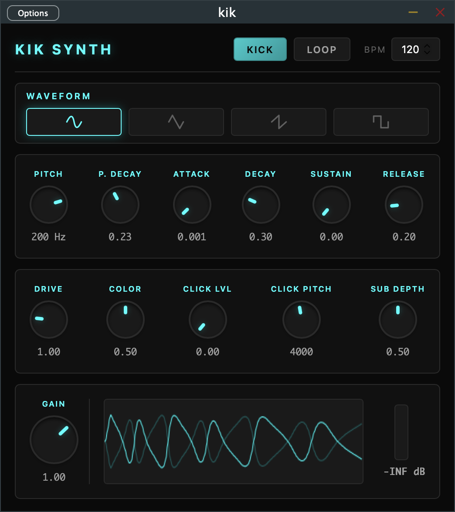

# Kik - Kick Synthesizer

A JUCE-based VST3/AU plugin for synthesizing kicks and bass drums.

## Download

You can download the latest version of KIK Synth from the [Releases Page](https://github.com/sanusart/kik/releases).

## Features

- **Waveform Selection**: Sine, Triangle, Sawtooth, Square
- **Pitch Engine**: Start frequency (Pitch) and pitch sweep rate (P. Decay)
- **Amplitude Envelope**: Full ADSR controls
- **Tone Controls**:
  - **Drive**: Nonlinear distortion / saturation
  - **Color**: Adds higher order harmonics
- **Transient & Sub**:
  - **Click Lvl & Pitch**: Tunable high-frequency transient for punch
  - **Sub Depth**: Sub-bass reinforcement at half pitch
- **Output**: Master gain and interactive UI peak meter
- **Playback**: Manual trigger (KICK) or automatic LOOP at variable BPM

## Building

1. Open `kik.jucer` in Projucer
2. Set JUCE module path (expects JUCE at `../../../JUCE`)
3. Export to Xcode and build

## Requirements

- JUCE 8.x (or your preferred version)
- Xcode for macOS

## Controls

| Control | Range | Description |
|---------|-------|-------------|
| Pitch | 40-250 Hz | Base starting frequency of the kick |
| P. Decay | 0.05-0.5 | Pitch sweep decay rate |
| Attack | 0-0.05s | Amplitude attack time |
| Decay | 0.05-1.0s | Amplitude decay time |
| Sustain | 0-1.0 | Amplitude sustain level |
| Release | 0.05-1.0s | Amplitude release time |
| Drive | 0.5-3.0 | Nonlinear drive / saturation amount |
| Color | 0-1.0 | Higher harmonics intensity |
| Click Lvl | 0-1.0 | High-frequency transient amount |
| Click Pitch| 500-8000 Hz | Frequency of the click transient |
| Sub Depth | 0-1.0 | Sub-bass amount added at half pitch |
| Gain | 0-1.5 | Final output gain |
| BPM | 80-250 | Tempo for the internal loop sequencer |

